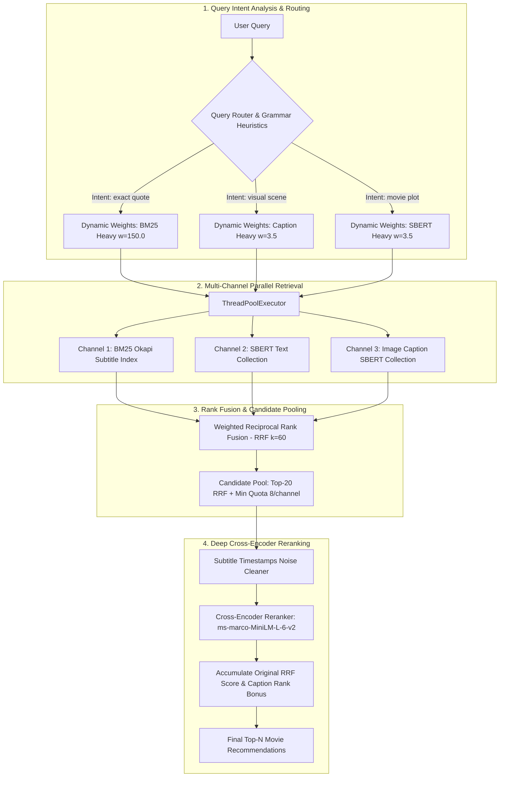

# 🎬 Multimodal Movie Search Engine

> **A next-generation intelligent movie retrieval system combining Vision-Language Models (VLM BLIP-2), Dense Semantic Embeddings (SBERT / CLIP), Script Keyword Search (BM25), Zero-Shot Intent Routing (Query Router), and Cross-Encoder Reranking.**

---

## 📌 Table of Contents
1. [Overview](#-overview)
2. [Key Innovations & Highlights](#-key-innovations--highlights)
3. [System Architecture (V1 ➔ V2 ➔ V3)](#-system-architecture)
4. [Project Directory Structure](#-project-directory-structure)
5. [System Requirements & Installation](#-system-requirements--installation)
6. [Step-by-Step Running Guide](#-step-by-step-running-guide)
   - [Step 1: Start VectorDB Using Docker](#step-1-start-vectordb-using-docker)
   - [Step 2: Build Database & Indexing](#step-2-build-database--indexing)
   - [Step 3: Run Interactive Search CLI](#step-3-run-interactive-search-cli)
   - [Step 4: Run Evaluation & Ablation Studies](#step-4-run-evaluation--ablation-studies)
7. [Technical Details & Mathematical Formulations](#-technical-details--mathematical-formulations)
8. [Experimental Results & Evaluation](#-experimental-results--evaluation)
9. [Environment Variables (.env)](#-environment-variables-env)
10. [Author & License](#-author--license)

---

## 🌟 Overview

Traditional movie search engines predominantly rely on shallow metadata such as movie titles, cast, directors, or genres. However, viewers often only recall fuzzy, fragmented clues:
- A memorable **exact movie quote or dialogue** (*"I am going to make him an offer he can't refuse"*).
- An abstract **semantic plot summary** (*"two completely opposite families one extremely rich and the other always lives in poverty"*).
- A striking **visual scene or frame description** (*"a woman screaming in a motel shower black and white"* or *"giant robots fighting monsters in the ocean"*).

This project resolves these challenges by constructing an advanced **Multimodal Search Engine** capable of understanding natural language queries across multiple modalities. It seamlessly aligns dialogue scripts, dense semantic plots, and visual movie frames transformed into text via state-of-the-art **Vision-Language Models (BLIP-2)**.

---

## 🚀 Key Innovations & Highlights

| Feature | Detailed Description |
| :--- | :--- |
| **Multimodal Vision-Language** | Leverages **BLIP-2 (`Salesforce/blip2-opt-2.7b`)** to automatically generate detailed visual captions from video frames, effectively eliminating the modality gap between raw images and natural language text queries. |
| **Intelligent Zero-Shot Routing** | Combines **BART-Large-MNLI** zero-shot classification with **grammatical dialogue heuristics** (first/second-person starter patterns), achieving **88.24% accuracy** in classifying query intent (`exact quote`, `movie plot`, `visual scene`). |
| **Dynamic Weighted RRF** | Employs **Weighted Reciprocal Rank Fusion** with dynamically allocated channel weights per intent, supported by a formal mathematical proof for $w_{\text{bm25}} = 150.0$ on exact quotes. |
| **Multi-Channel Parallel Retrieval** | Dispatches simultaneous asynchronous search across 3 channels (**BM25 Dialogue Index**, **SBERT Text/Summary Collection**, **SBERT Image Caption Collection**) via `ThreadPoolExecutor`. |
| **Sliding Window Script Chunking** | Processes dialogue transcripts using a sliding window (4 dialogue lines/chunk, 2-line overlap) to preserve conversational context. |
| **Candidate Pooling with Quotas** | Enforces a strict minimum candidate quota per channel (`MIN_QUOTA_PER_CHANNEL = 8`) within a Top-20 pool to prevent any single channel from overshadowing the others. |
| **Cross-Encoder Reranking** | Computes deep token-level relevance scores with **`ms-marco-MiniLM-L-6-v2`**, scrubs subtitle timestamp artifacts, and incorporates reciprocal rank and caption bonuses. |

---

## 🏗️ System Architecture

The search engine evolved through three major iterations:



### Version Evolution:
1. **V1 (Hybrid Baseline)**: Statically fused BM25 + SBERT/CLIP Text + raw CLIP Image embeddings. Overall MRR: **0.485**. *Limitation*: Static weights caused severe performance degradation on exact quotes and visual scene queries; raw text-to-image CLIP features suffered from significant cross-modal representation gaps.
2. **V2 (Intelligent Routing)**: Added zero-shot intent routing via HuggingFace API and intent-dependent dynamic RRF weights. Overall MRR: **0.5267**.
3. **V3 (Visual Captions + Parallel Multimodal Engine - Current SOTA)**: Integrated BLIP-2 VLM image captioning, transformed raw visual retrieval into dense SBERT caption retrieval, established a mathematical proof for BM25 weight guarantee, introduced channel candidate quotas, and refined the Cross-Encoder reranker. Overall MRR surged to **0.875** (**Hit@1: 80%**, **Hit@5: 100%**).

---

## 📂 Project Directory Structure

```
SearchEngine/
├── core/                               # Core shared utilities and configurations
│   ├── config.py                       # Path definitions, ChromaDB host/port, .env loader
│   ├── helpers.py                      # Folder name mappers, ID normalizers, NLTK tokenizer
│   └── __init__.py
├── data/                               # Data storage, datasets, and prebuilt indices
│   ├── DataMovie/                      # Individual movie directories (contains script/ and picture/)
│   │   ├── Inception/
│   │   │   ├── script/                 # Transcript / dialogue text files (.txt)
│   │   │   ├── picture/                # Extracted visual frames from the movie
│   │   │   └── Inception_captions.txt  # Generated captions from BLIP-2 VLM
│   │   └── ...
│   ├── movies_data.json                # Raw movie metadata (Vietnamese summaries)
│   ├── movies_data_english_clean.json  # Cleaned, deduplicated, and English-translated metadata
│   ├── bm25_index.pkl                  # Pickled BM25Okapi dialogue index and metadata
│   └── queries.json                    # Benchmark queries for evaluation
├── docs/                               # Architectural documentation and mathematical reports
│   └── v3_documentation.md             # Comprehensive report on system architecture and formulas
├── experiments/                        # Evaluation scripts and ablation study logs
│   ├── evaluate.py                     # Evaluation script for V1
│   ├── evaluate_v1_log.md              # Detailed ablation benchmark log for V1
│   ├── evaluate_v2.py                  # Evaluation script for V2
│   ├── evaluate_v2_log.md              # Detailed ablation benchmark log for V2
│   ├── evaluate_v3.py                  # Multi-channel ablation evaluation script for V3
│   └── evaluate_v3_log.md              # Evaluation log, metric breakdown, and confusion matrix for V3
├── src/                                # Source code for all architecture iterations
│   ├── v1/                             # Baseline hybrid retrieval implementation
│   ├── v2/                             # Dynamic intent routing retrieval implementation
│   └── v3/                             # SOTA multimodal VLM search engine implementation
│       ├── caption_generator.py        # BLIP-2 VLM visual frame caption generator
│       ├── db_builder.py               # ETL pipeline, sliding window chunking, ChromaDB builder
│       ├── router.py                   # Zero-shot intent classifier via HuggingFace API
│       ├── search_engine.py            # Multithreaded search engine, Dynamic RRF, Reranker
│       └── main.py                     # Interactive CLI Dashboard
├── docker-compose.yml                  # ChromaDB vector database Docker configuration
├── requirements.txt                    # Python project dependencies
├── .env                                # Environment variables (ChromaDB config, HF_TOKEN)
└── README.md                           # Project documentation and guide
```

---

## 💻 System Requirements & Installation

### 1. Hardware & Software Requirements
- **Operating System**: macOS / Linux / Windows.
- **Python**: Version `3.10` or higher.
- **Docker & Docker Compose**: For hosting the persistent ChromaDB Vector Store.
- **RAM**: Minimum 8GB (16GB+ recommended).
- **GPU (Optional)**: Needed only if generating visual captions locally from scratch with BLIP-2 (supports NVIDIA CUDA or Apple Silicon MPS). Running searches and evaluations runs smoothly on standard CPUs.

### 2. Virtual Environment Setup

Open your terminal at the root directory of the repository:

```bash
# Create a virtual environment
python3 -m venv .venv

# Activate the virtual environment
# On macOS / Linux:
source .venv/bin/activate

# On Windows (Command Prompt / PowerShell):
# .venv\Scripts\activate
```

### 3. Install Dependencies

```bash
pip install --upgrade pip
pip install -r requirements.txt
```

> **Optional for BLIP-2 VLM:** If you plan to execute `caption_generator.py` locally to produce new captions from images, install:
> ```bash
> pip install transformers accelerate
> ```

---

## 🛠️ Step-by-Step Running Guide

### Step 1: Start VectorDB Using Docker

The system relies on **ChromaDB** running inside a Docker container for high-performance vector similarity search.

Launch the ChromaDB service in the background:
```bash
docker-compose up -d
```

Verify that the container is healthy and running:
```bash
docker ps
```
*(You should see `movie_chromadb` running on port `8000`).*

---

### Step 2: Build Database & Indexing

If setting up the project for the first time or re-indexing the dataset:

```bash
python -m src.v3.main
```
Select menu option **`1. Khởi tạo/Nạp lại Database`** (Initialize/Rebuild Database):
- Enter **`a` (Fast Build)**: Uses pre-generated caption `.txt` files located under `data/DataMovie/` to populate ChromaDB (Recommended; takes ~1-2 minutes).
- Enter **`b` (Full Build)**: Automatically initializes BLIP-2 VLM, iterates through all movie frames under `picture/`, generates captions from scratch, and embeds them into ChromaDB.

The automated pipeline performs:
1. Translates Vietnamese movie summaries to English via `GoogleTranslator`.
2. Chunks subtitle scripts with a **Sliding Window** (4 dialogue lines/chunk, 2-line overlap).
3. Indexes dialogue chunks into **BM25Okapi** and exports to `data/bm25_index.pkl`.
4. Computes dense embeddings and registers 4 Collections in ChromaDB:
   - `text_sbert_collection` (SBERT 384d)
   - `text_clip_collection` (CLIP Text 512d)
   - `image_clip_collection` (CLIP Image 512d)
   - `image_caption_sbert_collection` (Caption SBERT 384d)

---

### Step 3: Run Interactive Search CLI

Launch the interactive console application:

```bash
python -m src.v3.main
```

Console menu interface:
```text
🌟🌟🌟🌟🌟🌟🌟🌟🌟🌟🌟🌟🌟🌟🌟🌟🌟🌟🌟🌟
🎬 MOVIE RETRIEVAL SYSTEM DASHBOARD (V3 - IMAGE CAPTIONS)
🌟🌟🌟🌟🌟🌟🌟🌟🌟🌟🌟🌟🌟🌟🌟🌟🌟🌟🌟🌟
1. 🛠️ Initialize / Rebuild Database
2. 🚀 HYBRID Search (Full V3 Pipeline: Router + RRF + Cross-Encoder Rerank)
3. 🧠 Semantic Arena: SBERT vs. CLIP Text
4. 🔑 Pure BM25 Keyword Search (Exact Dialogue/Quote)
5. 👁️ Visual Scene Arena: Raw CLIP Image vs. Image Caption (SBERT)
6. ❌ Exit
👉 Choose mode (1-6): 
```

#### Search Modes:
- **Mode 2 (HYBRID Search)**: Runs the complete end-to-end V3 pipeline: Query Router $\rightarrow$ Dynamic RRF $\rightarrow$ Multithreaded Retrieval $\rightarrow$ Candidate Pooling $\rightarrow$ Cross-Encoder Reranking.
- **Mode 3 (Semantic Arena)**: Side-by-side comparison between SBERT and CLIP Text on understanding conceptual plots.
- **Mode 4 (Pure BM25)**: Direct test of keyword recall on subtitle dialogue transcripts.
- **Mode 5 (Visual Scene Arena)**: Side-by-side comparison between raw image vector matching (`clip-ViT-B-32`) and VLM caption dense matching (BLIP-2 + SBERT).

#### Example Queries to Try:
- **Exact Quote**: `"I am going to make him an offer he can't refuse"` $\rightarrow$ Returns *The Godfather*.
- **Semantic Plot**: `"a banker wrongly convicted of murder escapes prison"` $\rightarrow$ Returns *The Shawshank Redemption*.
- **Visual Scene**: `"a woman screaming in a motel shower black and white"` $\rightarrow$ Returns *Psycho*.
- **Action Setting**: `"giant robots fighting monsters in the ocean"` $\rightarrow$ Returns *Pacific Rim: Uprising*.

---

### Step 4: Run Evaluation & Ablation Studies

To run the automated ablation study benchmark across 20 multi-category test cases and calculate **MRR**, **Hit@1**, **Hit@5**, and the **Confusion Matrix**:

```bash
python experiments/evaluate_v3.py
```

To run benchmarks on predecessor versions:
```bash
python experiments/evaluate.py      # Benchmark V1
python experiments/evaluate_v2.py   # Benchmark V2
```

---

## 🔬 Technical Details & Mathematical Formulations

### 1. Dialogue Sliding Window Chunking
Single dialogue lines are often too short and lack context. The system groups transcripts using a sliding window:
- $\text{WINDOW\_SIZE} = 4$: Groups 4 consecutive dialogue utterances.
- $\text{STEP} = 2$: Slides by 2 lines (50% overlap), preserving conversational continuity across chunk boundaries.

### 2. Weighted Reciprocal Rank Fusion (Weighted RRF)
For candidate movie $m$, the RRF score across retrieval channels $C$ is defined as:

$$\text{RRF\_Score}(m) = \sum_{c \in C} \frac{w_c}{k + r_c(m)}$$

Where:
- $k = 60$ (smoothing constant).
- $r_c(m)$ is the 1-indexed rank of movie $m$ in channel $c$.
- $w_c$ is the dynamic weight vector allocated according to the classified intent:

| Query Intent | BM25 Weight ($w_{\text{bm25}}$) | Text SBERT Weight ($w_{\text{txt}}$) | Caption SBERT Weight ($w_{\text{cap}}$) | Strategic Objective |
| :--- | :---: | :---: | :---: | :--- |
| `exact quote` | **150.0** | 1.5 | 0.5 | Absolute priority to verbatim script matching. |
| `visual scene` | 1.0 | 1.0 | **3.5** | High priority to VLM-generated visual scene captions. |
| `movie plot` | 1.0 | **3.5** | 1.0 | Priority to dense narrative semantics. |
| Default / Ambiguous | 1.0 | 2.0 | 1.0 | Balanced hybrid configuration. |

> 📐 **Mathematical Proof for $w_{\text{bm25}} = 150.0$:**
> To guarantee that a movie ranking #1 in BM25 ($r=1$) cannot be displaced by a competitor ranking #2 in BM25 ($r=2$) even when that competitor achieves #1 in both semantic channels:
> $$\frac{w_{\text{bm25}}}{61} > \frac{w_{\text{bm25}}}{62} + \frac{w_{\text{txt}} + w_{\text{cap}}}{61} \implies w_{\text{bm25}} > 62 \times (1.5 + 0.5) = 124.0$$
> Setting $w_{\text{bm25}} = 150.0 > 124.0$ strictly ensures that exact quote retrievals remain immune to semantic noise.

### 3. Multi-Factor Cross-Encoder Reranking
- **Model**: `cross-encoder/ms-marco-MiniLM-L-6-v2`.
- **Subtitle Scrubbing**: Removes timing timestamps (regex `r"\[\d{2}:\d{2}:\d{2}\s*->\s*\d{2}:\d{2}:\d{2}\]"`) to prevent spurious token attention.
- **Composite Score Formulation**:
  $$\text{Final\_Score}(m) = \frac{1}{60 + \text{Rank}_{\text{CE}}(m)} + 0.5 \times \text{RRF\_Original}(m) + \text{Bonus}_{\text{Caption}}(m)$$

---

## 📊 Experimental Results & Evaluation

The benchmark dataset consists of 20 challenging queries categorized into 4 distinct real-world scenarios:
1. **Group 1**: Exact Quotes (Verbatim script retrieval).
2. **Group 2**: Narrative & Plot Semantics (Conceptual plot summaries).
3. **Group 3**: Visual Imagery & Setting (Visual scene descriptions).
4. **Group 4**: Lexical Ambiguity & Adversarial Traps (Disambiguation).

### 1. Overall Performance Comparison

| Model / Architecture Variant | MRR (Mean Reciprocal Rank) | Hit@1 (Top-1 Accuracy) | Hit@5 (Top-5 Recall) |
| :--- | :---: | :---: | :---: |
| Pure BM25 (Keyword) | 0.6100 | 45.0% | 85.0% |
| Pure CLIP Text (Dense Text) | 0.4250 | 40.0% | 45.0% |
| Pure SBERT (Dense Semantic) | 0.7350 | 70.0% | 80.0% |
| Pure CLIP Image (Raw Visual) | 0.0867 | 0.0% | 30.0% |
| Image Caption SBERT (BLIP-2 + SBERT) | 0.3658 | 25.0% | 60.0% |
| **V1 Pipeline (PT2)** | 0.4850 | - | 55.0% |
| **V2 Pipeline (Zero-Shot Routing)** | 0.5267 | - | 60.0% |
| **🚀 V3 Pipeline (Full SOTA)** | **0.8750** | **80.0%** | **100.0%** |

### 2. Query Router Confusion Matrix

The router achieves **88.24% classification accuracy (15/17 unambiguous test cases)**:

| Expected Intent \ Predicted Intent | `exact quote` | `movie plot` | `visual scene` |
| :--- | :---: | :---: | :---: |
| **`exact quote`** | **5** | 0 | 0 |
| **`movie plot`** | 0 | **6** | 1 |
| **`visual scene`** | 0 | 1 | **4** |

---

## ⚙️ Environment Variables (.env)

Create a `.env` file in the root directory with the following configuration:

```env
# ChromaDB connection settings via Docker
CHROMA_HOST=localhost
CHROMA_PORT=8000

# Hugging Face Access Token (for BART-large-MNLI Zero-Shot Inference API)
HF_TOKEN=hf_your_huggingface_access_token_here
```

---

## 👥 Author & License

- **Graduation Thesis**: Multimodal Movie Retrieval System based on Vision-Language Models and Deep Semantic Search.
- **Author**: Nguyen Do Quang Trong (`nguyendoquangtrong`).
- This project is developed for academic research and educational purposes. Contributions, suggestions, and pull requests are warmly welcome!
