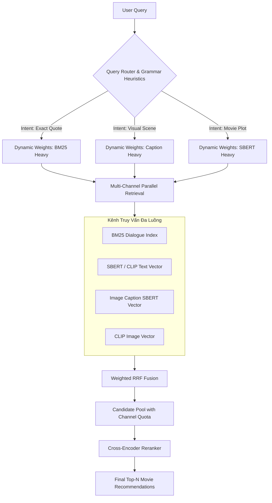

# BÁO CÁO TỔNG HỢP KIẾN TRÚC, MODULE, THÔNG SỐ VÀ CÔNG THỨC HỆ THỐNG V3
*(Multimodal Movie Search Engine with Visual Captions & Intelligent Routing)*

---

## 1. TỔNG QUAN KIẾN TRÚC HỆ THỐNG

Hệ thống **V3** là mô hình tìm kiếm phim đa thức (**Multimodal Search Engine**) tiên tiến, kết hợp giữa **Thị giác (VLM BLIP-2)**, **Ngữ nghĩa văn bản (SBERT / CLIP)**, **Tìm kiếm từ khóa (BM25)**, **Bộ định tuyến thông minh (Query Router)** và **Đánh giá lại kết quả (Cross-Encoder Reranking)**.

---

## 2. DANH SÁCH & CHỨC NĂNG CÁC MODULE TRONG `src/v3`

### 2.1. [caption_generator.py](file:///Users/ngtrong/Documents/Studies/Graduation_Thesis%20/Project/SearchEngine/src/v3/caption_generator.py)
* **Chức năng**: Tự động trích xuất mô tả hình ảnh (Visual Captions) bằng mô hình VLM (**BLIP-2**).
* **Quy trình**:
  1. Quét các file ảnh trong thư mục `picture/` của từng bộ phim.
  2. Tăng cường chất lượng hình ảnh (Brightness + Contrast) cho các cảnh tối/CGI.
  3. Đưa ảnh và prompt định hướng mô tả chi tiết vào mô hình `Salesforce/blip2-opt-2.7b`.
  4. Lọc kết quả, làm sạch rác ký tự và kiểm định câu Tiếng Anh ASCII chuẩn.
  5. Xuất kết quả ra file văn bản `<movie_name>_captions.txt`.

### 2.2. [db_builder.py](file:///Users/ngtrong/Documents/Studies/Graduation_Thesis%20/Project/SearchEngine/src/v3/db_builder.py)
* **Chức năng**: Quản lý quy trình ETL dữ liệu, dọn dẹp, dịch thuật, chunking kịch bản và nạp Vector vào ChromaDB.
* **Quy trình**:
  1. **Clean & Translate**: Loại bỏ phim bộ/series, dịch tóm tắt phim từ Tiếng Việt sang Tiếng Anh (`GoogleTranslator`).
  2. **Sliding Window Chunking**: Gom thoại kịch bản phim thành các chunk bằng kỹ thuật cửa sổ trượt (4 câu/chunk, overlap 2 câu).
  3. **BM25 Indexing**: Lập chỉ mục từ khóa bằng `BM25Okapi` cho toàn bộ văn bản kịch bản và lưu file `bm25_index.pkl`.
  4. **Vector Embedding**: Nạp Vector embeddings (SBERT, CLIP Text, CLIP Image, Caption SBERT) theo Batch vào 4 Collections trong ChromaDB Docker.

### 2.3. [router.py](file:///Users/ngtrong/Documents/Studies/Graduation_Thesis%20/Project/SearchEngine/src/v3/router.py)
* **Chức năng**: Phân loại ý định tìm kiếm (Query Intent Classification).
* **Quy trình**:
  1. Gửi văn bản truy vấn lên HuggingFace Inference API (`facebook/bart-large-mnli`).
  2. Phân loại Zero-shot thành 3 Intent: `exact quote` (câu thoại), `visual scene` (cảnh phim), `movie plot` (cốt truyện).
  3. Kết hợp Heuristics quy tắc ngữ pháp (`looks_like_dialogue`) để phát hiện câu thoại nhanh và chính xác hơn.

### 2.4. [search_engine.py](file:///Users/ngtrong/Documents/Studies/Graduation_Thesis%20/Project/SearchEngine/src/v3/search_engine.py)
* **Chức năng**: Thực thi quy trình tìm kiếm đa luồng, tổng hợp điểm RRF và Rerank.
* **Quy trình**:
  1. **Multi-threading**: Chạy đồng thời 3 kênh truy vấn (`_thread_bm25`, `_thread_text`, `_thread_image_caption`) bằng `ThreadPoolExecutor`.
  2. **Dynamic RRF Weight Allocation**: Gán trọng số RRF phù hợp với Intent được Router trả về.
  3. **Candidate Pooling**: Tạo Candidate Pool từ Top-20 RRF điểm cao nhất kết hợp Quota tối thiểu (`MIN_QUOTA_PER_CHANNEL = 8`) cho từng kênh.
  4. **Cross-Encoder Reranking**: Làm sạch nhiễu timestamp subtitle, tính điểm tương quan bằng `ms-marco-MiniLM-L-6-v2`, kết hợp điểm thưởng RRF và Caption Rank Bonus.

### 2.5. [main.py](file:///Users/ngtrong/Documents/Studies/Graduation_Thesis%20/Project/SearchEngine/src/v3/main.py)
* **Chức năng**: Giao diện dòng lệnh CLI (Interactive Console Dashboard) cho phép người dùng nạp lại Database, chạy truy vấn tổng hợp hoặc chạy kiểm thử độc lập từng luồng (Ablation testing).

### 2.6. [evaluate_v3.py](file:///Users/ngtrong/Documents/Studies/Graduation_Thesis%20/Project/SearchEngine/experiments/evaluate_v3.py)
* **Chức năng**: Bộ công cụ kiểm thử tự động (Ablation Study Framework) đo đạc hiệu năng của 6 mô hình/kênh truy vấn qua các chỉ số **MRR**, **Precision@K**, **Recall@K** và **Ma trận nhầm lẫn (Confusion Matrix)**.

---

## 3. THÔNG SỐ KỸ THUẬT CHI TIẾT (SYSTEM PARAMETERS)

| Module | Tên Thông Số | Giá Trị | Mục Đích & Ý Nghĩa |
| :--- | :--- | :--- | :--- |
| **BLIP-2 VLM** | `model_name` | `"Salesforce/blip2-opt-2.7b"` | Mô hình VLM sinh mô tả thị giác từ khung hình ảnh. |
| | `torch_dtype` | `torch.float16` / `torch.float32` | Chạy FP16 trên GPU CUDA để tiết kiệm VRAM và tăng tốc. |
| | `max_new_tokens` | `65` | Độ dài câu caption tối đa sinh ra. |
| | `min_new_tokens` | `20` | Đảm bảo câu caption đủ độ chi tiết bối cảnh. |
| | `repetition_penalty` | `1.15` | Phạt việc lặp lại cụm từ trong văn bản sinh ra. |
| | Image Enhancements | Brightness: `1.3`, Contrast: `1.1` | Tăng sáng và độ tương phản cho khung hình tối/CGI. |
| | VLM Filter Rules | Min len: `10`, ASCII: `32-126` | Lọc nhiễu, loại bỏ ký tự lạ và câu vô nghĩa. |
| **Embedding & Data** | CLIP Model | `"clip-ViT-B-32"` | Model Embedding đa thức 512 chiều (Text & Image). |
| | SBERT Model | `"all-MiniLM-L6-v2"` | Model Embedding ngữ nghĩa văn bản 384 chiều. |
| | `WINDOW_SIZE` | `4` | Số lượng câu thoại gom vào 1 chunk kịch bản. |
| | `STEP` | `2` | Bước trượt (Overlap 50% = 2 câu thoại). |
| | `BATCH_SIZE` | `32` | Kích thước batch khi encode và lưu vào ChromaDB. |
| **Router** | Model ID | `"facebook/bart-large-mnli"` | Model Zero-shot Classification qua HF Inference API. |
| | Label Mapping | `dialogue` $\rightarrow$ `exact quote` `story` $\rightarrow$ `movie plot` `picture` $\rightarrow$ `visual scene` | Quy đổi nhãn phân loại về intent hệ thống. |
| | `DIALOGUE_STARTERS` | Regex ngôi 1 & 2 (`i am`, `i'm`, `my`, `your`, `we're`, `let's`...) | Heuristic phát hiện nhanh câu thoại kịch bản. |
| **Search & RRF** | Dynamic RRF Weights | • `exact quote`: $(150.0, 1.5, 0.5)$ • `visual scene`: $(1.0, 1.0, 3.5)$ • `movie plot`: $(1.0, 3.5, 1.0)$ • Default: $(1.0, 2.0, 1.0)$ | Phân bổ trọng số RRF theo Intent $(w_{\text{bm25}}, w_{\text{txt}}, w_{\text{cap}})$. |
| | RRF Constant $k$ | `60` | Hằng số chuẩn hóa hạng xếp hạng RRF. |
| | `TOP_K_BY_SCORE` | `20` | Số lượng candidate lấy từ RRF score cao nhất. |
| | `MIN_QUOTA_PER_CHANNEL` | `8` | Số ứng viên tối thiểu bắt buộc giữ cho mỗi kênh. |
| **Reranker** | Reranker Model | `"cross-encoder/ms-marco-MiniLM-L-6-v2"` | Model Cross-Encoder chấm điểm tương quan văn bản. |
| | RRF Score Weight | `0.5` | Hệ số cộng dồn RRF vào điểm Rerank: $+ (\text{RRF} \times 0.5)$. |
| | Caption Rank Bonus | Top 1: $+0.3$, Top <3: $+0.15$, Top <10: $+0.05$ | Cộng điểm thưởng vị trí kênh Caption khi intent là `visual scene`. |

---

## 4. CÁC CÔNG THỨC TOÁN HỌC & THUẬT TOÁN ÁP DỤNG

### 4.1. Thuật Toán BM25Okapi (Keyword Search Score)
Điểm số tương đồng giữa câu hỏi $Q$ và tài liệu văn bản $D$:

$$\text{Score}_{\text{BM25}}(D, Q) = \sum_{i=1}^{N} \text{IDF}(q_i) \cdot \frac{f(q_i, D) \cdot (k_1 + 1)}{f(q_i, D) + k_1 \cdot \left(1 - b + b \cdot \frac{|D|}{\text{avgdl}}\right)}$$

Trong đó:
- $\text{IDF}(q_i) = \ln \left( \frac{N - n(q_i) + 0.5}{n(q_i) + 0.5} + 1 \right)$
- $f(q_i, D)$: Tần suất xuất hiện của từ $q_i$ trong văn bản $D$.
- $|D|$ và $\text{avgdl}$: Độ dài văn bản $D$ và độ dài trung bình của tất cả tài liệu trong tập dữ liệu.
- Mặc định: $k_1 = 1.5, b = 0.75$.

---

### 4.2. Độ Tương Đồng Cosine (Cosine Similarity for Dense Vectors)
Độ tương đồng góc giữa Vector truy vấn $\vec{q}$ và Vector tài liệu/hình ảnh $\vec{d}$:

$$\text{Sim}_{\text{Cosine}}(\vec{q}, \vec{d}) = \frac{\vec{q} \cdot \vec{d}}{\|\vec{q}\| \|\vec{d}\|} = \frac{\sum_{i=1}^{n} q_i d_i}{\sqrt{\sum_{i=1}^{n} q_i^2} \sqrt{\sum_{i=1}^{n} d_i^2}}$$

---

### 4.3. Dung Hội Xếp Hạng Trọng Số Động (Weighted Reciprocal Rank Fusion - Weighted RRF)
Tổng hợp vị trí xếp hạng từ các kênh $C = \{\text{BM25}, \text{Text SBERT/CLIP}, \text{Caption SBERT}\}$ dựa trên trọng số kênh $w_c$:

$$\text{RRF\_Score}(m) = \sum_{c \in C} \frac{w_c}{k + r_c(m)}$$

*Trong đó:*
- $m$: Bộ phim ứng viên.
- $k$: Hằng số nén rank ($k = 60$).
- $r_c(m)$: Thứ tự xếp hạng (1-indexed) của phim $m$ trong kênh $c$.
- $w_c$: Trọng số kênh tương ứng với Intent hiện tại.

#### Ma Trận Phân Bổ Trọng Số $w_c$ Theo Intent:
| Ý Định Truy Vấn (Intent) | Trọng số BM25 ($w_{\text{bm25}}$) | Trọng số Text SBERT ($w_{\text{txt}}$) | Trọng số Caption SBERT ($w_{\text{cap}}$) | Lý Do & Chiến Lược |
| :--- | :--- | :--- | :--- | :--- |
| `exact quote` | **150.0** | 1.5 | 0.5 | Ưu tiên tuyệt đối khớp từ khóa câu thoại kịch bản. |
| `visual scene` | 1.0 | 1.0 | **3.5** | Ưu tiên kênh Caption mô tả hình ảnh/khung cảnh. |
| `movie plot` | 1.0 | **3.5** | 1.0 | Ưu tiên kênh SBERT ngữ nghĩa tóm tắt cốt truyện. |
| `default / mơ hồ` | 1.0 | 2.0 | 1.0 | Cân bằng giữa ngữ nghĩa và từ khóa. |

#### 4.3.1. Phân Tích & Chứng Minh Toán Học Cho Việc Chọn Trọng Số $w_{\text{bm25}} = 150.0$ (`exact quote`)
Khi Intent là câu trích dẫn chính xác (`exact quote`), bài toán đặt ra là: **Bộ phim đứng Hạng 1 kênh BM25** ($r_{\text{bm25}} = 1$) tuyệt đối **không được bị vượt mặt** bởi một bộ phim chỉ đứng Hạng 2 kênh BM25 ($r_{\text{bm25}} = 2$) dù bộ phim Hạng 2 đó đạt điểm tối đa ở cả 2 kênh Semantic (SBERT Text và Caption SBERT).

Giả sử:
- **Phim A**: Hạng 1 BM25 ($r_{\text{bm25}} = 1$), Hạng rất thấp/không có ở Semantic ($r_{\text{txt}} = \infty, r_{\text{cap}} = \infty$).
  $$\text{RRF\_Score}(A) = \frac{w_{\text{bm25}}}{60 + 1} = \frac{w_{\text{bm25}}}{61}$$
- **Phim B**: Hạng 2 BM25 ($r_{\text{bm25}} = 2$), Hạng 1 ở cả 2 kênh Semantic ($r_{\text{txt}} = 1, r_{\text{cap}} = 1$).
  $$\text{RRF\_Score}(B) = \frac{w_{\text{bm25}}}{60 + 2} + \frac{w_{\text{txt}}}{60 + 1} + \frac{w_{\text{cap}}}{60 + 1} = \frac{w_{\text{bm25}}}{62} + \frac{w_{\text{txt}} + w_{\text{cap}}}{61}$$

Để bảo đảm **Phim A luôn xếp trên Phim B** ($\text{RRF\_Score}(A) > \text{RRF\_Score}(B)$):

$$\frac{w_{\text{bm25}}}{61} > \frac{w_{\text{bm25}}}{62} + \frac{w_{\text{txt}} + w_{\text{cap}}}{61}$$

$$\Longleftrightarrow w_{\text{bm25}} \left( \frac{1}{61} - \frac{1}{62} \right) > \frac{w_{\text{txt}} + w_{\text{cap}}}{61}$$

$$\Longleftrightarrow w_{\text{bm25}} \left( \frac{1}{61 \times 62} \right) > \frac{w_{\text{txt}} + w_{\text{cap}}}{61}$$

$$\Longleftrightarrow w_{\text{bm25}} > 62 \times (w_{\text{txt}} + w_{\text{cap}})$$

Với $w_{\text{txt}} = 1.5$ và $w_{\text{cap}} = 0.5 \Rightarrow w_{\text{txt}} + w_{\text{cap}} = 2.0$:

$$w_{\text{bm25}} > 62 \times 2.0 = 124.0$$

Do đó, chọn **$w_{\text{bm25}} = 150.0 > 124.0$** đảm bảo tính chính xác tuyệt đối cho các câu trích dẫn câu thoại.

---

### 4.4. Điểm Đánh Giá Rerank Cuối Cùng (Final Rerank Score)
Điểm tổng hợp sau bước Cross-Encoder nhằm giữ độ ổn định cho kết quả:

$$Final\_Score(m) = RRF_{CE}(m) + (0.5 \times RRF\_Original(m)) + Bonus_{Caption}(m)$$

*Trong đó:*
- $RRF_{CE}(m) = \frac{1}{60 + Rank_{CE}(m)}$ là điểm số dung hợp dựa trên thứ hạng (1-indexed) của ứng viên khi được sắp xếp theo điểm CrossEncoder dự đoán.
- $\text{CleanContext}(m)$: Văn bản ngữ cảnh đã loại bỏ chuỗi nhiễu mốc thời gian vietsub (regex `r"\[\d{2}:\d{2}:\d{2}\s*->\s*\d{2}:\d{2}:\d{2}\]"`).
- $\text{Bonus}_{\text{Caption}}(m)$: Điểm cộng thưởng theo vị trí của phim trong kênh Caption nếu Intent là `visual scene`.

---

## 5. BỘ ĐÁNH GIÁ VÀ CHỈ SỐ HỆ THỐNG (EVALUATION METRICS)

1. **Mean Reciprocal Rank (MRR)**:
   $$\text{MRR} = \frac{1}{|Q|} \sum_{i=1}^{|Q|} \frac{1}{\text{rank}_i}$$
   *(với $\text{rank}_i$ là thứ hạng đầu tiên tìm thấy đáp án đúng của câu hỏi $i$)*.

2. **Precision@K**:
   $$\text{Precision@K} = \frac{|\text{Số phim đúng trong Top K}|}{K}$$

3. **Recall@K**:
   $$\text{Recall@K} = \frac{|\text{Số phim đúng trong Top K}|}{|\text{Tổng số phim đúng của Query}|}$$

4. **Router Accuracy (Ma Trận Nhầm Lẫn)**:
   $$\text{Accuracy}_{\text{Router}} = \frac{\sum \text{Số câu Router dự đoán đúng Intent}}{\text{Tổng số câu hỏi đánh giá}}$$
